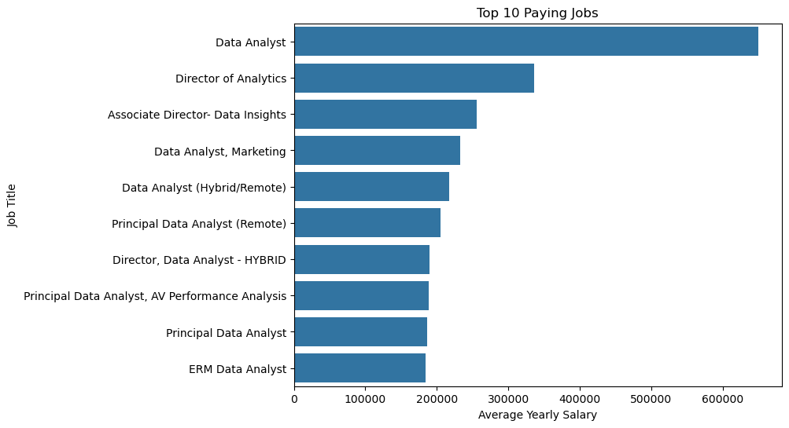
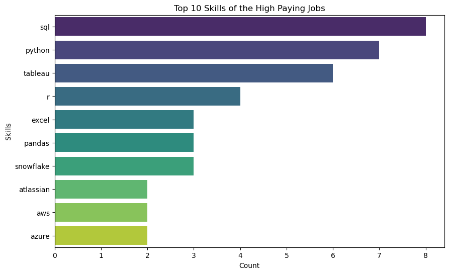

# Data Jobs Analysis
## Introduction

Job searching as a data analyst can be challenging, especially when trying to find the best-paying opportunities and understanding which skills are in demand. This project analyzes a dataset of 2023 job postings to uncover key insights into high-paying data analyst roles and the skills required to land them.  

Using **SQL** for data exploration and **Python** for visualization, I extracted meaningful trends that can guide job seekers in their career decisions. Whether you're looking for your first role or aiming for a promotion, this analysis provides valuable insights into job titles, salary expectations, top employers,location, and essential skills.  


## Project Overview
This project is based on the [Data Jobs 2023](https://lukebarousse.com/sql) dataset, which contains job postings for various data roles, not restricted to Data Analysts, Data Scientists, and Data Engineers. The dataset includes information on job titles, salaries, required skills, company names, and locations.

The analysis focuses specifically on **Data Analyst** positions, filtering out other roles to extract relevant insights. 

#### The questions I answered through my SQL queries were:

1. What are the top-paying data analyst jobs?
2. What skills are required for these top-paying jobs?
3. What skills are most in demand for data analysts?
4. Which skills are associated with higher salaries?
5. What are the most optimal skills to learn?


## Tools Used
To conduct this analysis effectively, I leveraged a combination of database management, data analysis, and visualization tools.
 

- **SQL & PostgreSQL** – Extracted and analyzed job data efficiently.  
- **Python (Pandas, Matplotlib, Seaborn)** – Processed, analyzed, and visualized key insights.  
- **Jupyter Notebook** – Used for exploration and visualization.  
- **Visual Studio Code** – Executed SQL queries and managed the project environment.  
- **Git & GitHub** – Tracked changes, maintained version control, and shared findings.  


## The Analysis
Each query for this project aimed at investigating specific aspects of the data analyst job market. Here’s how I worked through each question:

### 1. Top Paying Data Analyst Jobs
To identify the highest-paying roles, I filtered data analyst positions by average yearly salary and location, focusing on remote jobs. This query highlights the high paying opportunities in the field.

```sql
select job_id,
    job_title,
    job_schedule_type,
    salary_year_avg,
    job_posted_date,
    name as company_name 
from job_postings_fact
left join company_dim on job_postings_fact.company_id = company_dim.company_id
where 
    job_title_short = 'Data Analyst' and 
    salary_year_avg is not null and 
    job_location = 'Anywhere'
order by salary_year_avg desc
limit 10;
```
Here's the breakdown of the top data analyst jobs in 2023:
- **Wide Salary Range:** Top 10 paying data analyst roles span from $184,000 to $650,000, indicating significant salary potential in the field.
- **Diverse Employers:** Companies like SmartAsset, Meta, and AT&T are among those offering high salaries, showing a broad interest across different industries.
- **Job Title Variety:** There's a high diversity in job titles, from Data Analyst to Director of Analytics, reflecting varied roles and specializations within data analytics.


*Bar graph visualizing the salary for the top 10 salaries for data analysts*


### 2. Skills for Top Paying Jobs
To understand what skills are required for the top-paying jobs, I joined the job postings with the skills data, providing insights into what employers value for high-compensation roles.

```sql
with top_paying_job as (
    select job_id,
        job_title,
        salary_year_avg,
        name as company_name 
    from job_postings_fact
    left join company_dim  on job_postings_fact.company_id = company_dim.company_id
    where 
        job_title_short = 'Data Analyst' and 
        salary_year_avg is not null and 
        job_location = 'Anywhere'
    order by salary_year_avg desc
    limit 10
)

select 
    top_paying_job.job_id,
    job_title,
    salary_year_avg,
    company_name,
    skills,
    type
from top_paying_job
inner join skills_job_dim 
    on top_paying_job.job_id = skills_job_dim.job_id
inner join skills_dim 
    on skills_job_dim.skill_id = skills_dim.skill_id
order by salary_year_avg desc;
```

Here's the breakdown of the most demanded skills for data analysts in 2023, based on job postings:
- **SQL** leads the way with 8 out of 10 top-paying roles requiring it.
**Python** follows closely with 7 mentions, reinforcing its importance in data analytics.
- **Tableau** remains in high demand, appearing in 6 job postings, highlighting the need for data visualization skills.
- Other notable skills include **R**, **Snowflake**, **Pandas**, and **Excel**, showing varying levels of demand.
- Skill Categories: The most sought-after skills fall into key areas such as programming, cloud platforms, analytical tools, and data manipulation libraries, all essential for Data Analysts aiming for high salaries.  


*Bar graph visualizing the count of skills for the top 10 paying jobs for data analysts*

### 3. In-Demand Skills for Data Analysts
This query helped identify the skills most frequently requested in job postings, directing focus to areas with high demand.

```sql
select 
    skills,
    count(skills_job_dim.job_id) as demand_count
from job_postings_fact 
inner join skills_job_dim  on job_postings_fact.job_id = skills_job_dim.job_id
inner join skills_dim on skills_job_dim.skill_id = skills_dim.skill_id
where job_title_short = 'Data Analyst' and 
    job_work_from_home = True
group by skills
order by demand_count DESC
limit 5;
```
Here's the breakdown of the most demanded skills for data analysts in 2023
- **SQL** and **Excel** remain fundamental, emphasizing the need for strong foundational skills in data processing and spreadsheet manipulation.
- **Programming** and **Visualization Tools** like **Python**, **Tableau**, and **Power BI** are essential, pointing towards the increasing importance of technical skills in data storytelling and decision support.

| Skills   | Demand Count |
|----------|--------------|
| SQL      | 7291         |
| Excel    | 4611         |
| Python   | 4330         |
| Tableau  | 3745         |
| Power BI | 2609         |

*Table of the demand for the top 5 skills in data analyst job postings*

### 4. Skills Based on Salary
Exploring the average salaries associated with different skills revealed which skills are the highest paying.

```sql
select 
    skills,
    round(avg(salary_year_avg)) as avg_salary
from job_postings_fact
inner join skills_job_dim ON job_postings_fact.job_id = skills_job_dim.job_id
inner join skills_dim ON skills_job_dim.skill_id = skills_dim.skill_id
where job_title_short = 'Data Analyst' and 
    salary_year_avg is not null and 
    job_work_from_home = True
group by Skills
order by avg_salary desc
limit 30;
```
Here's a breakdown of the results for top paying skills for Data Analysts:
- **High Demand for Big Data & ML Skills:** Top salaries are commanded by analysts skilled in big data technologies (PySpark, Couchbase), machine learning tools (DataRobot, Jupyter), and Python libraries (Pandas, NumPy), reflecting the industry's high valuation of data processing and predictive modeling capabilities.
- **Software Development & Deployment Proficiency:** Knowledge in development and deployment tools (GitLab, Kubernetes, Airflow) indicates a lucrative crossover between data analysis and engineering, with a premium on skills that facilitate automation and efficient data pipeline management.
- **Cloud Computing Expertise:** Familiarity with cloud and data engineering tools (Elasticsearch, Databricks, GCP) underscores the growing importance of cloud-based analytics environments, suggesting that cloud proficiency significantly boosts earning potential in data analytics.

| Skills        | Average Salary ($) |
|---------------|-------------------:|
| pyspark       |            208,172 |
| bitbucket     |            189,155 |
| couchbase     |            160,515 |
| watson        |            160,515 |
| datarobot     |            155,486 |
| gitlab        |            154,500 |
| swift         |            153,750 |
| jupyter       |            152,777 |
| pandas        |            151,821 |
| elasticsearch |            145,000 |

*Table of the average salary for the top 10 paying skills for data analysts*

### 5. Most Optimal Skills to Learn
Combining insights from demand and salary data, this query aimed to pinpoint skills that are both in high demand and have high salaries, offering a strategic focus for skill development.

```sql
SELECT 
    skills_dim.skill_id,
    skills_dim.skills,
    COUNT(skills_job_dim.job_id) AS demand_count,
    ROUND(AVG(job_postings_fact.salary_year_avg), 0) AS avg_salary
FROM job_postings_fact
INNER JOIN skills_job_dim ON job_postings_fact.job_id = skills_job_dim.job_id
INNER JOIN skills_dim ON skills_job_dim.skill_id = skills_dim.skill_id
WHERE
    job_title_short = 'Data Analyst'
    AND salary_year_avg IS NOT NULL
    AND job_work_from_home = True 
GROUP BY
    skills_dim.skill_id
HAVING
    COUNT(skills_job_dim.job_id) > 10
ORDER BY
    avg_salary DESC,
    demand_count DESC
LIMIT 25;
```

| Skill ID | Skills     | Demand Count | Average Salary ($) |
|----------|------------|--------------|-------------------:|
| 8        | go         | 27           |            115,320 |
| 234      | confluence | 11           |            114,210 |
| 97       | hadoop     | 22           |            113,193 |
| 80       | snowflake  | 37           |            112,948 |
| 74       | azure      | 34           |            111,225 |
| 77       | bigquery   | 13           |            109,654 |
| 76       | aws        | 32           |            108,317 |
| 4        | java       | 17           |            106,906 |
| 194      | ssis       | 12           |            106,683 |
| 233      | jira       | 20           |            104,918 |

*Table of the most optimal skills for data analyst sorted by salary*

Here's a breakdown of the most optimal skills for Data Analysts in 2023: 
- **High-Demand Programming Languages:** Python and R stand out for their high demand, with demand counts of 236 and 148 respectively. Despite their high demand, their average salaries are around $101,397 for Python and $100,499 for R, indicating that proficiency in these languages is highly valued but also widely available.
- **Cloud Tools and Technologies:** Skills in specialized technologies such as Snowflake, Azure, AWS, and BigQuery show significant demand with relatively high average salaries, pointing towards the growing importance of cloud platforms and big data technologies in data analysis.
- **Business Intelligence and Visualization Tools:** Tableau and Looker, with demand counts of 230 and 49 respectively, and average salaries around $99,288 and $103,795, highlight the critical role of data visualization and business intelligence in deriving actionable insights from data.
- **Database Technologies:** The demand for skills in traditional and NoSQL databases (Oracle, SQL Server, NoSQL) with average salaries ranging from $97,786 to $104,534, reflects the enduring need for data storage, retrieval, and management expertise.


## Key Findings
From the analysis, several general insights were:

1. **Top-Paying Data Analyst Jobs**: The highest-paying jobs for data analysts that allow remote work offer a wide range of salaries, the highest at $650,000!
2. **Skills for Top-Paying Jobs**: High-paying data analyst jobs require advanced proficiency in SQL, suggesting it’s a critical skill for earning a top salary.
3. **Most In-Demand Skills**: SQL is also the most demanded skill in the data analyst job market, thus making it essential for job seekers.
4. **Skills with Higher Salaries**: Specialized skills, such as SVN and Solidity, are associated with the highest average salaries, indicating a premium on niche expertise.
5. **Optimal Skills for Job Market Value**: SQL leads in demand and offers for a high average salary, positioning it as one of the most optimal skills for data analysts to learn to maximize their market value.

## Conclusion

This project provided valuable insights into the job market for data analysts, highlighting the highest-paying roles, required skills, and industry trends. By leveraging SQL and visualization tools, I was able to extract meaningful information that can guide job seekers in targeting the right opportunities and skill development.  

Beyond the analysis, this project also reinforced my ability to work with large datasets, write efficient SQL queries, and translate raw data into actionable insights. As the data job market evolves, staying updated on industry trends and continuously refining technical skills will be key to career growth.  


